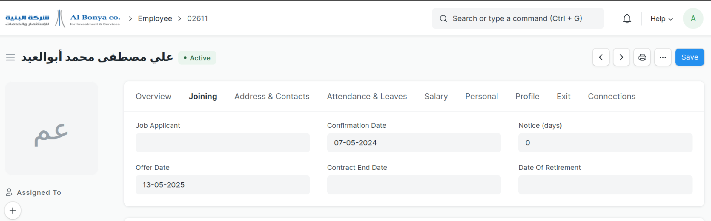

## Albounya

Albounya

#### License

MIT

#### Payroll Customization :

Ovrride Salary Slip Class to featch the Evaluation from the last Salay str assignment

#### Payroll Reaport :
the monthly reports puted in (payroll entry) print formatt
to be easily edit from website side and print

Full Report :
تم تصميم هذا التقرير بطريقة عامة ليمكن عرض
- مكونات متعددة
- مجموع مكونات محددة ( مثلا يتم احتياج تقرير بمجموع البدلات و التي هي : بدل كروت بدر وقود, بدل مواصلات)
- المرتب الصافي
- السلف

به مشكلة كون letter heade تحتاج للاختيار اليدوي

#### تقرير الحوافظ
يوجد تقرير الحوافظ في طباعة ال payroll entry كل على حده
 يجب ان تكون قسيمة الراتب مرتبطه بالدورة دخول المرتبات لتظهر ضمن اين تقرير من التقارير الشهرية المخصصة للدورة

يوجد تقرير عام اسمه salary to bank 

يمكن استخدامه لاظهار حوافظ اجماليه على ستوى الشركة او الفروع او ل مصرف محدد
(به فلاتر و سماحية أكثر)

#### تقرير العقود

تقرير العقود المستمرة

يعتمرد على بيانات الموظفين
يقود بجلب ( نشط
نوع التعيين غير مصنف
قيمة العقد من اخر اسناد هيلكية راتب نشطة
تاريخ تأكيد العقد و تاريخ انتهاء العقد في بيانات الموظف الشخصية
)

هذا التقرير مشترك لكل من المواردا لبشرية و المرتبات

    